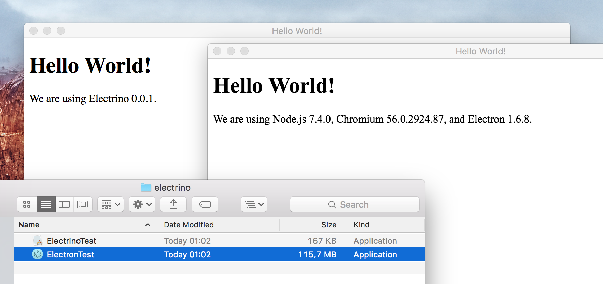

# electrino

A desktop runtime for apps built on web technologies, using the system's own web browser engine.

Electrino is an experimental featherweight alternative to the popular and powerful [Electron](https://github.com/electron/electron). It implements a minuscule portion of the APIs available in Electron, but the output app size is much smaller.

A "Hello World" app takes 115 MB using Electron, but only 167 kB using Electrino:

This comparison is completely unfair because Electrino currently doesn't do anything more than this...! You can load a web page, access some basic Electron/Node APIs, and that's it. Electrino is nothing more than a proof of concept at present.

The current implementation is only for macOS. A Windows port using Microsoft Edge seems potentially interesting though.

### Roadmap

Nothing planned right now. The best way to proceed would probably be to implement APIs used by real apps... So if you have a small Electron-based Mac app and you'd like to try putting it on an Electrino diet, let's give it a try! My contact info is below.

### Contact

Pauli Olavi Ojala
@pauliooj
pauli @ lacquer.fi
